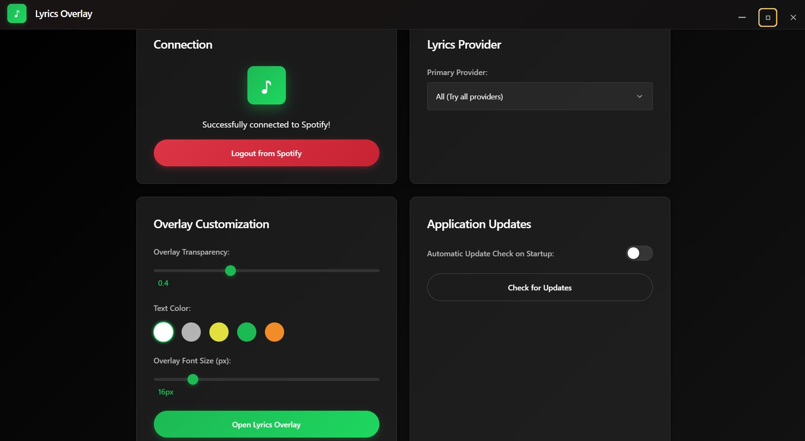
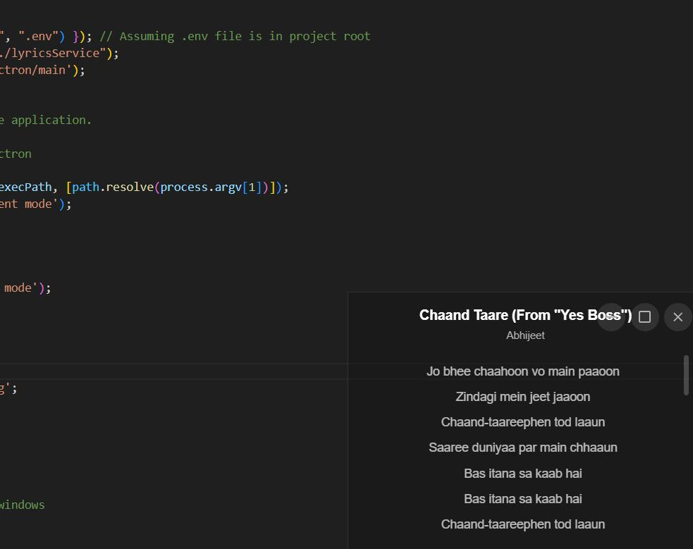

# LyricsFloat Desktop v1.0.0 🎶
**Real-time lyrics overlay for Spotify**

### This Repo is only for [Releases Page](https://github.com/sonisumit7904/LyricsFloat_Desktop_Releases/releases),

Contact me at sonisumit7904@gmail.com

---

### How to Use
1. **Download**: Get the installer: **LyricsFloat_Desktop.Setup.1.0.0.exe** from the [Releases Page](https://github.com/sonisumit7904/LyricsFloat_Desktop_Releases/releases).
2. **Install**: Run the installer, click **Next** through the steps, and finish.
3. **Launch**: Open the app, go to **Settings**, and click **Connect to Spotify**.
4. **Authorize**: Log in to Spotify in the browser and grant permissions.
5. **Play Music**: Start a song in Spotify, open the overlay, and enjoy synced lyrics!

---

### Notes
- If lyrics don’t appear, try switching songs.
- Customize overlay settings in the app.

Enjoy your music with LyricsFloat Desktop! 🎵

---

# Features

### 🎵 Spotify Integration
- Seamless connection with your Spotify account
- Real-time tracking of currently playing songs
- Automatic lyrics updates when tracks change

### 🎨 Customizable Overlay
- Adjustable transparency, text, and background colors
- Resizable and repositionable window
- Always-on-top mode for uninterrupted viewing

### 📝 Lyrics Sources
- Multiple providers: Musixmatch, YouTube, Lyrics.ovh
- Choose your preferred provider or use all

---

# Troubleshooting

### Common Issues
- **Lyrics not found**: Switch providers or check your connection.
- **Spotify connection issues**: Re-login or check your account.
- **Overlay not appearing**: Restart the app or check window layers.

---

# Feedback and Support
Submit issues or suggestions on our [GitHub page](https://github.com/sonisumit7904/LyricsFloat_Desktop_Releases/issues).